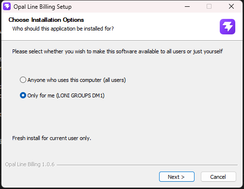
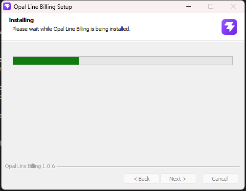
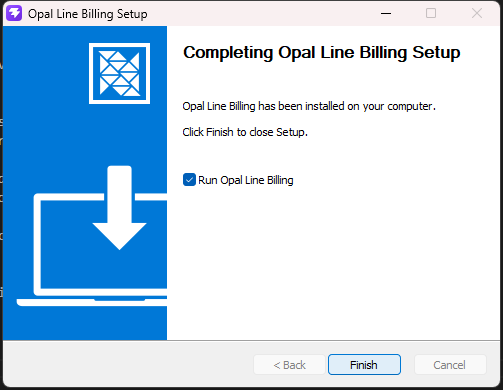

# Opal Line Billing ERP

A jewellery-billing ERP for silver retailers: point-of-sale billing, Shopify
two-way sync, fulfilment and supply-chain control — desktop app (Electron) or
self-hosted web stack.

**Frontend** React 19 + Vite + Tailwind · **Backend** Express + Drizzle +
PostgreSQL (postgres.js) · **Desktop** Electron (Windows NSIS installer, signed)

---

## What it does

| Area | Highlights |
|---|---|
| **Billing** | Silver-rate priced invoices ((rate + making charge) × weight + GST), quotations with validity terms, credit notes/returns, HSN & GST reports, TDS register, double-entry accounting (trial balance, P&L, balance sheet, journal) |
| **Shopify sync** | Two-way product sync (incl. collections, descriptions with sanitised HTML, images policy), order import with PII recovery, customer sync, inventory push, price push, webhook + email-ingest redaction workarounds |
| **Supply chain** | Order pipeline (drag or bulk-move stages), bulk packing slips & pick lists with product photos, dispatch/shipments, bookings, purchase orders & supplier dues, scan stock counts with Shopify round-trip |
| **Printing** | Print Designer (5 doc types: invoice, quotation, order, packing slip, pick list), saved templates with defaults, design import/export (`.opal-print.json`), auto UPI QR on invoices |
| **Ops & security** | RBAC (per-user permissions), audit + activity logs, encrypted backups with auto-email & off-site push (S3-compatible), session controls (log out other devices), rate limiting persisted in Postgres, webhook replay protection, magic-byte upload validation |

## Screenshots

| | |
|---|---|
| **Dashboard** — KPIs, silver rate, low-stock alerts | **Sales orders** — bulk packing slips / pick lists with product thumbnails |
|  |  |
| **Invoices** — GST billing with UPI QR | **Invoice detail** — print / PDF with product images |
|  |  |
| **Quotations** — validity terms, one-click print | **Products** — catalogue with Shopify sync status |
|  |  |

## Ports

Opal Line reserves the dedicated port block **47191–47198** so the dev stack,
the installed desktop app and a Docker deployment can coexist on one machine.

| Port | Used by |
|---|---|
| **5432** | PostgreSQL (standard port) — the dev database (`DATABASE_URL` in `backend/.env`) |
| **47191** | Backend API in development (`npm run dev:server`) |
| **47192** | Backend API of the installed desktop app (bundled runtime) |
| **47193** | PostgreSQL of the installed desktop app (portable, `%APPDATA%\Opal Line Billing\pgdata`) |
| **47195** | Vite dev server (UI in development) |
| **47196** | Backend in Docker (`docker-compose.yml`, container listens on 4000) |
| **47197** | Frontend in Docker (nginx) |
| **47198** | PostgreSQL in Docker (container listens on 5432) |

In Docker the backend reaches the database over the compose network
(`DATABASE_URL=...@db:5432`), so 47198 is only for host-side tools. Dev vs
desktop never collide: dev uses 47191/47195 + external PG on 5432, the desktop
app uses its own 47192/47193 pair and refuses to start with a clear message if
those are taken.

## Repository layout

```
frontend/           React + Vite + Tailwind UI (billing software)
backend/            Express + Drizzle + PostgreSQL API, Shopify sync, pricing
electron/           Electron main/preload + electron-builder config
e2e/                Playwright end-to-end tests (53)
docs/               Guides (Flow webhook, release notes draft)
scripts/            Build, desktop packaging and maintenance utilities
```

## Quick start (development)

Prerequisites: **Node.js 20 LTS+**, **PostgreSQL 14+**, npm 9+.

```bash
npm install              # installs both workspaces (hoisted to root)
cp backend/.env.example backend/.env
# edit backend/.env → DATABASE_URL (and Shopify creds, or set them in the UI)
npm run db:push          # create/update the schema
npm run db:seed          # seed roles, admin user, sample data
npm run dev              # backend on http://localhost:47191 + UI on http://127.0.0.1:47195
```

Default seeded login: **admin / Opal@2026** (change it in Users & Roles).

Run pieces separately: `npm run dev:server` (backend only) or `npm run dev:web`
(frontend only). All configuration — env vars, in-app settings, Shopify,
integrations — is documented step-by-step in
**[docs/CONFIGURATION.md](docs/CONFIGURATION.md)**.

## Common tasks

```bash
npm run build          # typecheck + build the frontend
npm run lint           # lint the frontend
npm run typecheck      # typecheck the backend
npm run start:server   # run the backend without watch mode
npm test               # backend unit tests (run inside backend/)
npx playwright test    # full e2e suite (needs the dev stack running)
```

## Install the desktop app (Windows installer)

The installer is fully self-contained: **no Node.js, no PostgreSQL, no admin
rights needed** on the target machine. Download
`Opal-Line-Billing-Setup-<version>.exe` from the
[GitHub Releases](https://github.com/kumarboobesh765-code/Opal-Line/releases)
page, or build it yourself (last subsection).

### Install steps

1. Run `Opal-Line-Billing-Setup-<version>.exe`. It is code-signed — SmartScreen
   shows **Opal Line Jewels LLP** as the verified publisher, and no UAC prompt
   appears.
2. On **Choose Installation Options**, pick "Anyone who uses this computer"
   or "Only for me" — either way no admin rights are needed. Click *Next*.

   

3. The wizard copies the app, the bundled backend and PostgreSQL
   (~145 MB, about half a minute).

   

4. Click *Finish* on the completion page. **Run Opal Line Billing** is ticked
   by default — leave it to launch straight away. First launch automatically:
   - initializes the bundled PostgreSQL 16.4 into
     `%APPDATA%\Opal Line Billing\pgdata` (port **47193**),
   - starts the backend API (port **47192**) and applies the schema + seed
     roles, then shows a one-time dialog with the generated **admin**
     password (store it — it is displayed only once).

   

5. Log in as **admin** with the generated password and change it in
   *System → Users & Roles*.

### What's inside

| Component | Detail |
|---|---|
| Backend API | Express, runs via Electron's Node (`ELECTRON_RUN_AS_NODE`) — port **47192** |
| Database | Portable PostgreSQL 16.4, data in `%APPDATA%\Opal Line Billing\pgdata` — port **47193** |
| UI | Built React app served by the backend from `resources/frontend/dist` |
| App files | `%LOCALAPPDATA%\Programs\Opal Line Billing` |
| User data | `%APPDATA%\Opal Line Billing` (pgdata, logs, backups) |

Nothing is installed machine-wide. Uninstalling keeps your data
(`deleteAppDataOnUninstall: false`) — back up via *System → Backup & Restore*;
delete `%APPDATA%\Opal Line Billing` afterwards only if you want a clean wipe.

### Verify after install

- *System → Status* in the app shows **Database: healthy** with live pool stats.
- Or probe the API: `curl http://127.0.0.1:47192/api/v1/health` →
  `"database":{"healthy":true,...}`.
- Connect Shopify under *System → Connections*, then check the sync as
  described in [Verify database & Shopify sync](#verify-database--shopify-sync).

### Repeatable installer smoke test

A committed script silently installs the built installer, verifies the
extracted tree (app.asar, backend bundle, frontend, PostgreSQL incl. timezone
data and VC++ runtime), checks the Authenticode signature and uninstall entry,
boots the app and probes ports 47192/47193:

```powershell
powershell -NoProfile -ExecutionPolicy Bypass -File scripts/smoke-test-install.ps1 -StopAtEnd
```

The full Playwright suite can also run against the **installed app** (it must
be running). Pass its port and the generated admin password (shown once on
first launch):

```bash
E2E_BASE_URL=http://127.0.0.1:47192 E2E_PASSWORD=<generated-password> npx playwright test
# 52 pass, 1 skips — the repaired-demo-order test needs dev-store data
```

Note: NSIS remembers the last chosen install directory (e.g. from a previous
`/allusers` test run) and a silent install will reuse it — if the script fails
on path checks, uninstall via the existing *Uninstall Opal Line Billing*
entry first, then re-run.

### Build the installer yourself

```bash
npm run electron:build   # signed NSIS installer → dist-electron/
```

Requires Node.js 20+; downloads portable PostgreSQL 16.4 on first run. Bundles
the frontend dist, esbuild-bundled backend and native deps. Code-signing
requires a certificate whose subject contains **Opal Line Billing** (see
`.github/workflows/release.yml`) — a missing/mismatched cert fails the build
instead of shipping unsigned.

## Shopify integration

1. Create a **Custom App** in Shopify Admin → Settings → Apps → Develop apps.
2. Grant `read/write` on products, orders, customers, inventory.
3. Paste the **store URL + Admin API token** in the ERP: *System → Connections*
   (stored encrypted in the database) or via env vars.
4. For dev stores (PII redacted on the API): set up the **Flow webhook** and/or
   **order email ingestion** so customer name/address auto-fills — see
   [docs/shopify-flow-webhook.md](docs/shopify-flow-webhook.md).

Sync runs from the ERP: *Shopify → Orders / Products / Customers / Inventory /
Price*, plus push tools (products, prices, inventory) and the stock-count
round-trip. Collections attach to products as pipe-separated titles
(`Rings | Home page`). Images pushed to Shopify are strictly the ones you
uploaded or linked — Shopify round-trip URLs are never re-sent.

### Verify database & Shopify sync

```bash
# 1. Database health (also visible in-app: System → Status)
curl http://127.0.0.1:47191/api/v1/health
# → "database":{"configured":true,"healthy":true,"latencyMs":1,...}

# 2. Shopify connection + per-resource totals
curl -b cookies.txt http://127.0.0.1:47191/api/v1/shopify/status
# → {"configured":true,"store":"...","totals":{"orders":43,...}}

# 3. Run a sync (auth + CSRF required; from the UI: Shopify → Sync)
curl -b cookies.txt -X POST http://127.0.0.1:47191/api/v1/shopify/sync \
  -H "Content-Type: application/json" -H "X-CSRF-Token: $CSRF" \
  -d '{"resources":["orders","products","customers","inventory"]}'
# → {"ok":true,"results":{...},"db":{"orders":"43 updated",...}}
```

For each resource the sync response reports `ok` and the imported/updated
count, and the `db` block summarises what was written. On a dev/trial Shopify
store the **price** resource can report `ok: false` when no products carry an
active price on the store — that is a store-plan limitation, not a sync
failure. If a sync errors, check *System → Status* logs and the webhook/email
ingest fallbacks in [docs/shopify-flow-webhook.md](docs/shopify-flow-webhook.md).

## Documentation

- [docs/CONFIGURATION.md](docs/CONFIGURATION.md) — every config knob: env
  vars with examples, in-app settings, Shopify, email/WhatsApp/Razorpay,
  backups, logging, tunnels, desktop build
- [docs/shopify-flow-webhook.md](docs/shopify-flow-webhook.md) — auto-fill
  customer PII on new orders via Shopify Flow
- [DEPLOYMENT.md](DEPLOYMENT.md) — production deployment guide
- [ROADMAP.md](ROADMAP.md) — planned work

## License

Private — © Opal Line Jewels LLP. All rights reserved.
