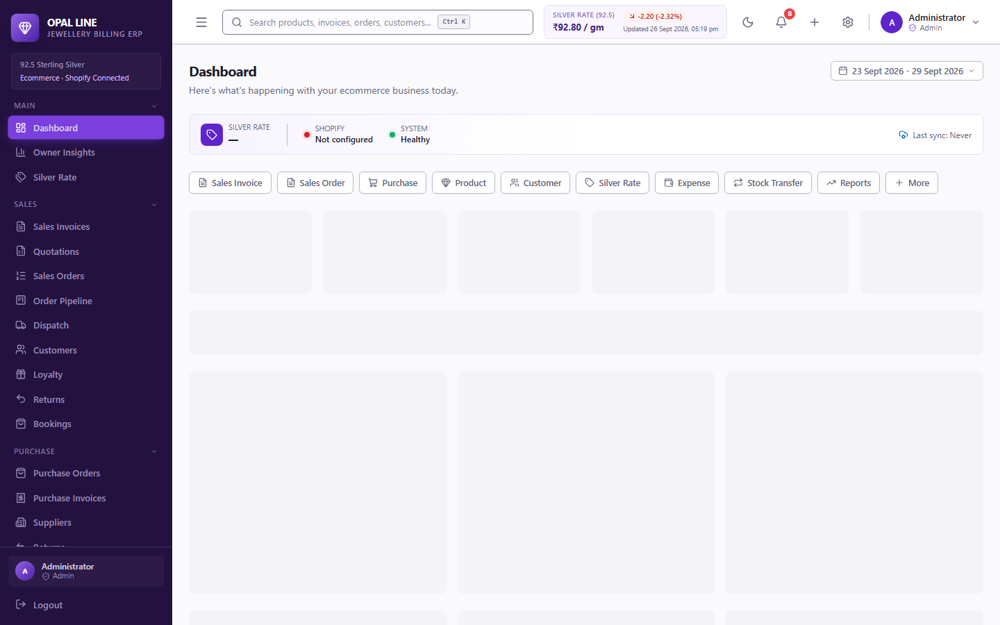
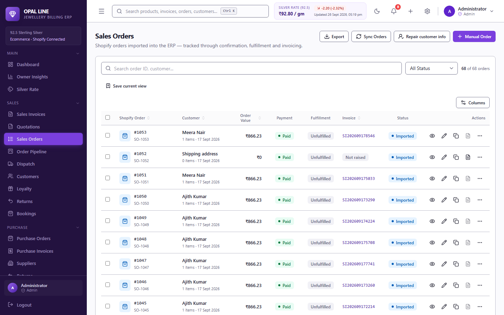
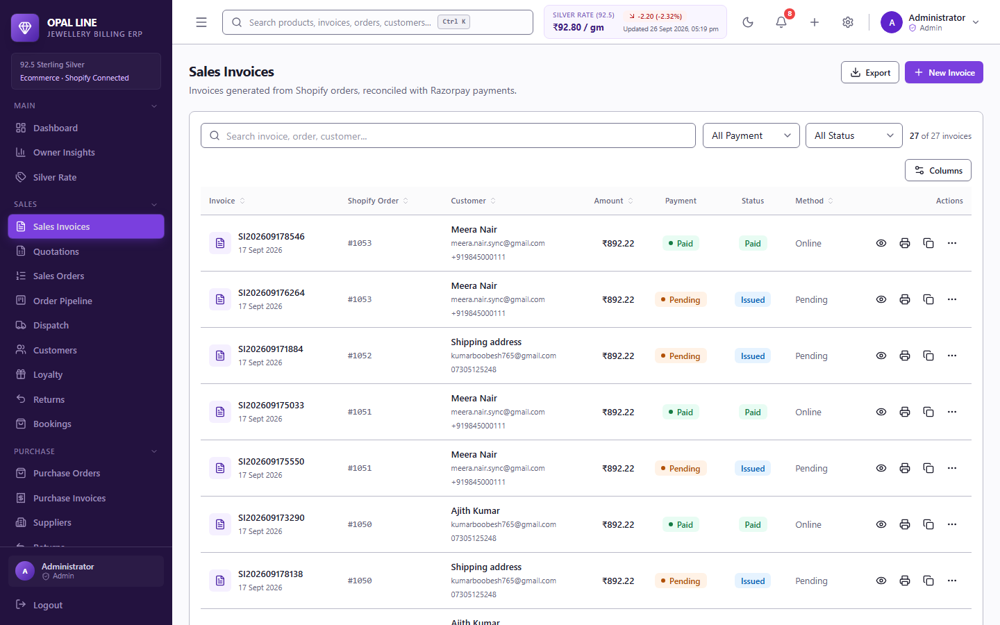
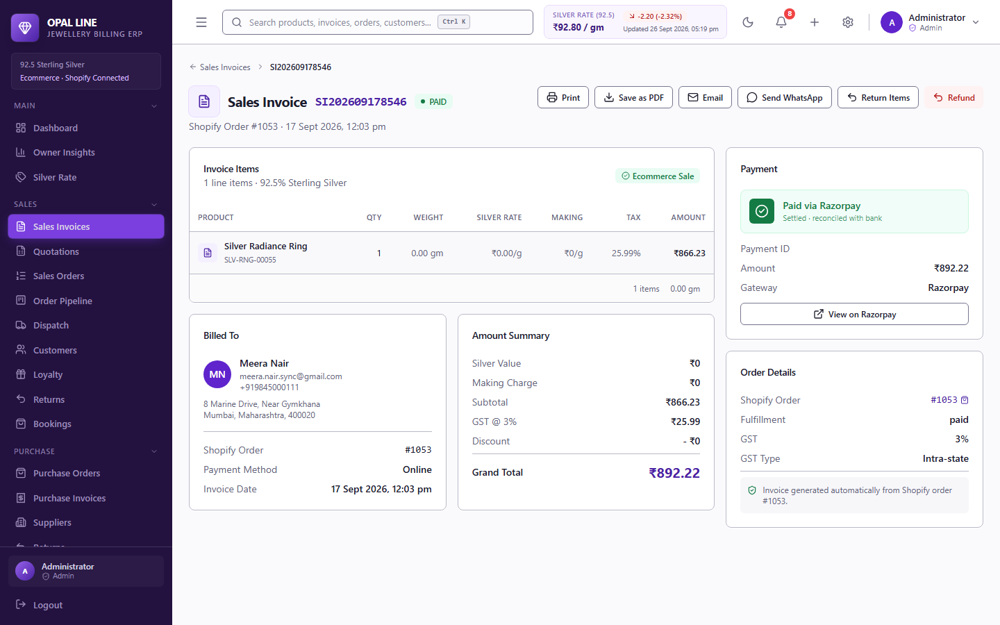
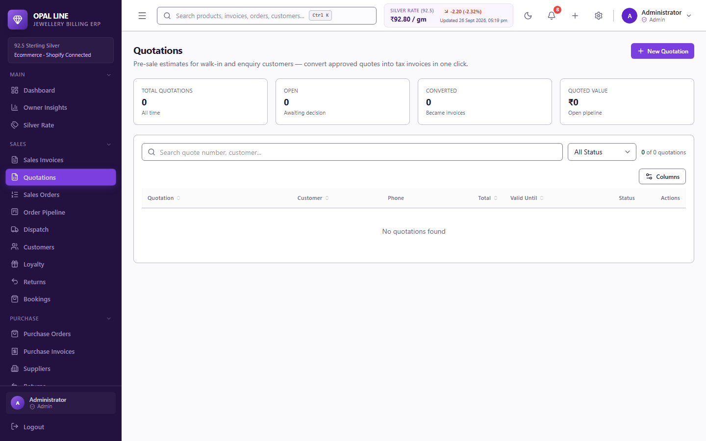
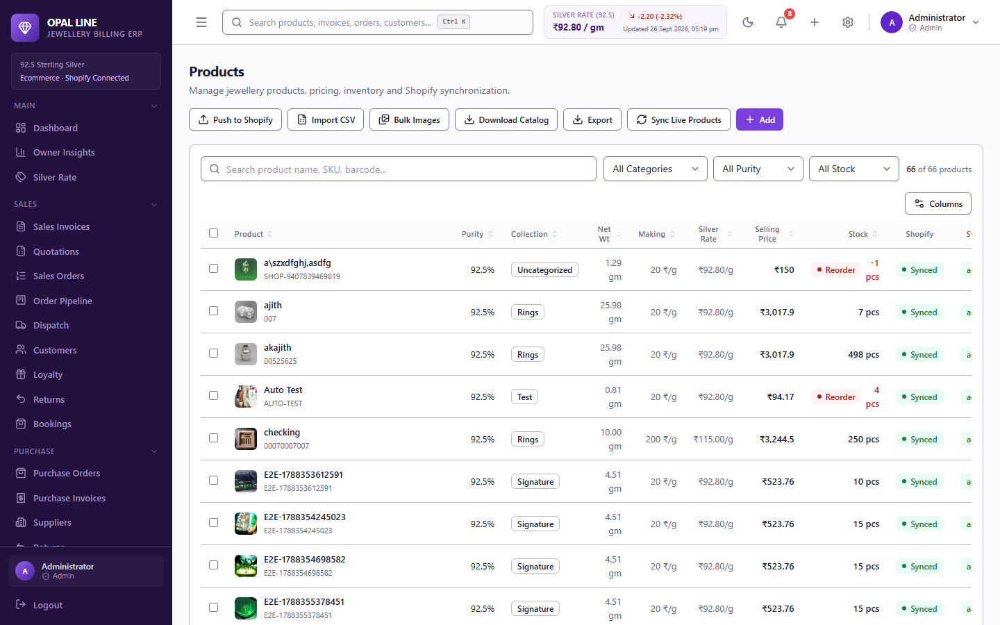

# Opal Line Billing ERP

A jewellery-billing ERP for silver retailers: point-of-sale billing, Shopify
two-way sync, fulfilment and supply-chain control — desktop app (Electron) or
self-hosted web stack.

**Frontend** React 19 + Vite + Tailwind · **Backend** Express + Drizzle +
PostgreSQL (postgres.js) · **Desktop** Electron (Windows NSIS installer, signed)

---

## What it does

| Area | Highlights |
|---|---|
| **Billing** | Silver-rate priced invoices ((rate + making charge) × weight + GST), quotations with validity terms, credit notes/returns, HSN & GST reports, TDS register, double-entry accounting (trial balance, P&L, balance sheet, journal) |
| **Shopify sync** | Two-way product sync (incl. collections, descriptions with sanitised HTML, images policy), order import with PII recovery, customer sync, inventory push, price push, webhook + email-ingest redaction workarounds |
| **Supply chain** | Order pipeline (drag or bulk-move stages), bulk packing slips & pick lists with product photos, dispatch/shipments, bookings, purchase orders & supplier dues, scan stock counts with Shopify round-trip |
| **Printing** | Print Designer (5 doc types: invoice, quotation, order, packing slip, pick list), saved templates with defaults, design import/export (`.opal-print.json`), auto UPI QR on invoices |
| **Ops & security** | RBAC (per-user permissions), audit + activity logs, encrypted backups with auto-email & off-site push (S3-compatible), session controls (log out other devices), rate limiting persisted in Postgres, webhook replay protection, magic-byte upload validation |

## Screenshots

| | |
|---|---|
| **Dashboard** — KPIs, silver rate, low-stock alerts | **Sales orders** — bulk packing slips / pick lists with product thumbnails |
|  |  |
| **Invoices** — GST billing with UPI QR | **Invoice detail** — print / PDF with product images |
|  |  |
| **Quotations** — validity terms, one-click print | **Products** — catalogue with Shopify sync status |
|  |  |

## Repository layout

```
frontend/           React + Vite + Tailwind UI (billing software)
backend/            Express + Drizzle + PostgreSQL API, Shopify sync, pricing
electron/           Electron main/preload + electron-builder config
e2e/                Playwright end-to-end tests (53)
docs/               Guides (Flow webhook, release notes draft)
scripts/            Build, desktop packaging and maintenance utilities
```

## Quick start (development)

Prerequisites: **Node.js 20 LTS+**, **PostgreSQL 14+**, npm 9+.

```bash
npm install              # installs both workspaces (hoisted to root)
cp backend/.env.example backend/.env
# edit backend/.env → DATABASE_URL (and Shopify creds, or set them in the UI)
npm run db:push          # create/update the schema
npm run db:seed          # seed roles, admin user, sample data
npm run dev              # backend on http://localhost:47191 + UI on http://127.0.0.1:47195
```

Default seeded login: **admin / Opal@2026** (change it in Users & Roles).

Run pieces separately: `npm run dev:server` (backend only) or `npm run dev:web`
(frontend only). All configuration — env vars, in-app settings, Shopify,
integrations — is documented step-by-step in
**[docs/CONFIGURATION.md](docs/CONFIGURATION.md)**.

## Common tasks

```bash
npm run build          # typecheck + build the frontend
npm run lint           # lint the frontend
npm run typecheck      # typecheck the backend
npm run start:server   # run the backend without watch mode
npm test               # backend unit tests (run inside backend/)
npx playwright test    # full e2e suite (needs the dev stack running)
```

## Desktop app (Windows installer)

```bash
npm run electron:build   # signed NSIS installer → dist-electron/
```

Bundles frontend dist, esbuild-bundled backend, portable PostgreSQL and
native deps. Code-signing requires a certificate whose subject contains
**Opal Line Billing** (see `.github/workflows/release.yml`).

## Shopify integration

1. Create a **Custom App** in Shopify Admin → Settings → Apps → Develop apps.
2. Grant `read/write` on products, orders, customers, inventory.
3. Paste the **store URL + Admin API token** in the ERP: *System → Connections*
   (stored encrypted in the database) or via env vars.
4. For dev stores (PII redacted on the API): set up the **Flow webhook** and/or
   **order email ingestion** so customer name/address auto-fills — see
   [docs/shopify-flow-webhook.md](docs/shopify-flow-webhook.md).

Sync runs from the ERP: *Shopify → Orders / Products / Customers / Inventory /
Price*, plus push tools (products, prices, inventory) and the stock-count
round-trip. Collections attach to products as pipe-separated titles
(`Rings | Home page`). Images pushed to Shopify are strictly the ones you
uploaded or linked — Shopify round-trip URLs are never re-sent.

## Documentation

- [docs/CONFIGURATION.md](docs/CONFIGURATION.md) — every config knob: env
  vars with examples, in-app settings, Shopify, email/WhatsApp/Razorpay,
  backups, logging, tunnels, desktop build
- [docs/shopify-flow-webhook.md](docs/shopify-flow-webhook.md) — auto-fill
  customer PII on new orders via Shopify Flow
- [DEPLOYMENT.md](DEPLOYMENT.md) — production deployment guide
- [ROADMAP.md](ROADMAP.md) — planned work

## License

Private — © Opal Line Jewels LLP. All rights reserved.
